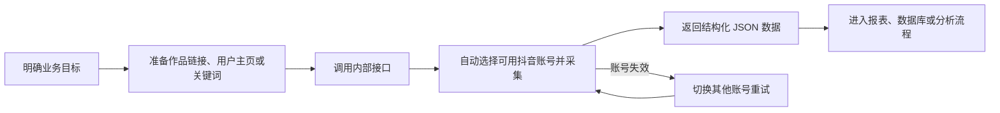

# 抖音数据采集服务——业务介绍

> 面向对象：运营、市场、品牌、舆情、内容分析、产品及项目管理人员\
> 文档版本：2026-08-14\
> 服务定位：公司内网使用的抖音公开数据采集能力

## 一句话介绍

本项目把抖音作品、评论、达人主页作品和关键词搜索结果统一封装成内部接口，业务系统提交作品链接、用户主页或关键词后，即可获得结构化数据，用于内容观察、账号研究、活动复盘和舆情分析。

它是一个“数据获取底座”，不是直接面向业务人员的数据看板，也不负责自动生成分析结论。

## 项目能解决什么问题

日常业务工作中，人工逐条打开抖音页面、复制作品信息和整理评论，通常耗时较长，也难以形成稳定、可复用的数据流程。本项目主要解决以下问题：

- 将分散在抖音页面中的公开信息整理为统一的结构化数据；
- 支持批量查询作品，减少重复的人工操作；
- 支持评论分页获取，为用户反馈、舆情和需求洞察提供原始材料；
- 支持按达人主页获取作品，便于观察账号内容表现；
- 支持按关键词和条件搜索作品，便于开展行业、品牌和热点研究；
- 通过多个已授权账号轮换工作，降低单个账号临时失效对业务任务的影响；
- 为数据中台、报表、分析脚本和内部业务系统提供统一的数据入口。

## 当前可用能力

| 能力    | 业务输入               | 主要输出                   | 单次范围       | 典型用途             |
| ----- | ------------------ | ---------------------- | ---------- | ---------------- |
| 作品详情  | 作品 ID，或 1～20 个作品链接 | 作品信息、作者信息、互动指标、媒体地址等   | 最多 20 个作品  | 爆款拆解、投放复盘、内容台账   |
| 一级评论  | 作品 ID 或作品链接        | 评论内容、评论用户、点赞数、回复数及分页信息 | 每页 1～50 条  | 舆情监测、反馈归类、用户洞察   |
| 用户作品  | 用户主页链接或用户 ID       | 用户信息及其作品列表             | 1～10 页     | 达人研究、竞品账号观察、内容盘点 |
| 关键词搜索 | 关键词及筛选条件           | 匹配作品及作者、互动等信息          | 最多 100 个作品 | 热点追踪、品类研究、竞品监测   |
| 账号状态  | 无                  | 可用、冷却、失效账号数量及账号别名      | 实时查询       | 判断采集服务是否具备工作条件   |
| 扫码登录  | 内部账号别名和抖音扫码        | 更新后的登录状态               | 同时 1 个扫码会话 | 新增账号、刷新过期账号      |

### 关键词搜索支持的筛选条件

- 排序：综合排序、最多点赞、最新发布；
- 发布时间：不限、一天内、一周内、半年内；
- 视频时长：不限、一分钟内、一至五分钟、五分钟以上；
- 内容类型：不限、视频、图文；
- 搜索范围：不限、最近看过、还未看过、关注的人。

### 二级评论

项目支持获取指定一级评论下的二级回复，每页可请求 1～50 条。调用方需要提供作品 ID 和一级评论 ID，并根据返回的下一页游标持续翻页。该能力已纳入正式接口文档；由于结果仍受登录账号可见范围和抖音上游限制影响，业务接入时建议进行结果抽检。

## 能拿到哪些数据

### 作品数据

作品详情、用户作品和搜索结果会统一整理为相近的数据结构，主要包括：

| 数据类别   | 示例字段                   |
| ------ | ---------------------- |
| 作品标识   | 作品 ID、作品链接、作品类型（视频/图集） |
| 内容信息   | 标题、描述、话题标签、发布时间        |
| 互动表现   | 点赞数、评论数、收藏数、分享数        |
| 媒体信息   | 封面地址、视频地址、图片地址列表       |
| 作者信息   | 用户主页、用户 ID、昵称、头像、简介    |
| 作者规模   | 关注数、粉丝数、获赞与收藏数、作品数     |
| 其他公开信息 | 年龄、性别、IP 归属地等上游可返回字段   |

部分字段可能因作品类型、账号可见范围或抖音返回结果不同而缺失或显示为“未知”。互动指标是采集时点的快照，不代表实时持续更新。

### 评论数据

评论接口直接返回抖音上游的评论对象，通常可包含：

- 评论 ID、评论正文和发布时间；
- 评论用户的公开信息；
- 评论点赞数；
- 回复数量；
- 下一页位置和是否还有更多数据。

由于评论采用分页方式返回，如需完整评论集合，调用方需要根据“是否还有更多”和“下一页位置”持续请求。评论可能被作者或平台删除，采集结果也可能受登录账号可见范围影响。

## 业务使用流程

建议的协作分工：

| 角色      | 主要职责                     |
| ------- | ------------------------ |
| 业务方     | 明确采集对象、字段、频率、数据用途和保存期限   |
| 产品/数据人员 | 设计任务规则、清洗口径、报表或分析模型      |
| 研发人员    | 对接接口、处理分页、保存结果、设置重试和告警   |
| 运维/管理员  | 部署服务、维护数据库、监控健康状态、组织账号扫码 |
| 合规/安全人员 | 审核采集范围、访问权限、数据使用和留存策略    |

## 典型业务场景

### 1. 品牌与竞品内容观察

通过品牌词、产品词、活动词搜索作品，持续记录作品数量、互动表现、热门话题和代表性内容，用于判断市场热度和内容方向。

### 2. 达人与账号研究

根据达人主页获取近期作品，分析发布节奏、内容类型、互动差异和高表现作品，为达人筛选、合作评估和竞品账号研究提供数据基础。

### 3. 用户反馈与舆情分析

针对指定作品分页获取评论，对评论进行情感、主题、问题和建议分类，辅助发现用户关注点及潜在风险。项目只负责获取原始数据，情感判断和标签体系需要由下游分析系统完成。

### 4. 活动或投放复盘

批量查询活动相关作品，记录采集时点的点赞、评论、收藏、分享等指标，与业务台账结合后评估内容传播表现。

### 5. 内容选题研究

通过关键词、发布时间、排序方式和内容类型筛选相关作品，发现近期热门表达、常见话题和内容形式，为选题策划提供样本。

## 服务如何保障连续性

- 多账号轮换：请求会在可用账号之间轮流分配，避免流量长期集中到单个账号；
- 账号故障切换：发现明确的登录失效后，当前账号会进入冷却，并自动换用另一个账号完整重试一次；
- 定时刷新：服务默认每 5 分钟从数据库同步最新账号凭证；
- 并发保护：服务和单账号都有并发上限，避免瞬时请求过多；
- 部分成功：批量作品查询中，个别作品失败不会影响已经成功的结果；
- 问题追踪：每次请求都有唯一请求编号，可用于技术人员定位日志。

以上机制用于提高可用性，但不构成业务 SLA。抖音页面、接口、风控规则或网络环境变化仍可能导致暂时不可用。

## 当前业务边界

### 当前不提供

- 不提供直接可视化看板、趋势图或自动分析报告；
- 不自动写入 Excel，也不自动接入业务数据库；
- 不在接口链路中下载视频、封面或图片文件；
- 不提供定时任务、任务队列或历史数据增量管理；
- 不保证获取某个作品或账号的全部历史数据；
- 不绕过登录、权限、隐私设置或平台限制；
- 直播、私信等底层遗留能力未开放为当前 HTTP 服务；
- 接口本身不提供面向公网的 API Key 鉴权能力，不应直接暴露到互联网。

项目仍保留一套旧版命令行工具，可将数据写入 Excel、下载媒体和生成详情文件，但它与当前内部接口服务是两条独立使用链路，不建议业务方将旧版工具作为正式系统集成方式。

### 数据完整性说明

- 数据取决于采集时点抖音实际返回的内容；
- 私密、删除、审核中、区域受限或账号不可见的内容可能无法获取；
- 搜索结果由抖音排序和推荐机制决定，不等同于平台全量数据；
- 数量指标会持续变化，同一对象在不同时间采集可能得到不同结果；
- 媒体地址可能具有时效性，不应被当作永久存储地址；
- 上游字段可能调整，下游系统应允许非核心字段缺失。

## 合规与安全要求

本服务仅限受控公司内网和经授权的业务场景使用。使用前应确认采集目的、对象、频率、字段和留存方式符合适用法律法规、抖音平台规则及公司数据安全制度。

业务使用时应遵循以下原则：

- 只采集实现明确业务目的所必需的数据；
- 不用于骚扰、画像歧视、非法营销或其他未经授权的用途；
- 涉及用户评论和个人信息时，应限制访问范围并设置合理保存期限；
- 不在文档、群聊、工单或日志中传播 Cookie、验证码等账号凭证；
- 不将服务直接开放到公网，应由内网网关和访问策略控制调用方；
- 对外展示或形成结论前，应进行数据抽检，并标明数据时间范围与口径；
- 业务结束后，按公司制度清理不再需要的原始数据和导出文件。

## 接入前需要确认的事项

业务方发起需求时，建议至少提供以下信息：

1. 业务目标：要回答什么问题，最终交付物是什么；
2. 采集对象：作品链接、达人主页、关键词或其组合；
3. 数据范围：需要哪些字段、多少作品、多少页评论；
4. 时间范围：一次性采集还是周期性采集；
5. 更新频率：小时、天、周或按活动节点；
6. 交付方式：内部系统、数据库、Excel、看板或分析报告；
7. 数据口径：去重方式、统计时点、无效内容和缺失值处理；
8. 合规要求：访问人员、保存期限、脱敏和删除规则；
9. 验收标准：数量、字段完整率、抽检比例和允许失败范围。

### 推荐的首次试运行方式

先选择一小批有代表性的样本，例如 5～10 个作品、1～2 个达人主页和 2～3 个关键词，完成一次端到端试采。业务方确认字段含义、结果质量和下游展示后，再扩大数量或增加定时任务。

## 业务验收建议

| 验收项   | 建议检查内容                     |
| ----- | -------------------------- |
| 对象准确性 | 返回的作品、作者或评论是否与输入对象一致       |
| 字段可用性 | 核心字段是否满足报表或分析要求，缺失值是否可接受   |
| 分页完整性 | 评论任务是否正确读取全部目标页，是否存在重复数据   |
| 时间口径  | 采集时间、作品发布时间和指标统计时点是否清晰     |
| 异常处理  | 个别内容失效、账号冷却或上游异常时是否可追踪、可重试 |
| 数据安全  | 结果访问、导出、共享和删除是否符合权限要求      |

不建议只按“接口返回成功”验收。更重要的是确认采集结果能否支撑具体业务结论，以及下游是否正确处理分页、重复、缺失和动态变化的数据。

## 常见问题

### 能否直接导出 Excel？

当前正式接口只返回结构化 JSON，不直接生成 Excel。需要由调用方或数据平台完成入库和导出。项目中的旧版命令行工具可以生成 Excel，但不属于正式接口链路。

### 能否直接下载视频和图片？

正式接口不下载媒体文件，但作品结果中可能包含视频、封面或图片地址。地址可能过期，是否下载及如何保存需要单独评估存储成本和合规要求。

### 能否一次拿到某个视频的所有评论？

不能通过单次请求保证获取全部评论。评论接口按页返回，调用方需要循环翻页；删除、不可见、平台限制等情况仍可能造成结果不完整。

### 为什么同一个关键词每次结果不同？

搜索结果受发布时间、排序、登录账号、平台推荐和内容状态影响，是某一时点的结果快照，不是固定的全量索引。

### 账号过期后是否需要人工处理？

服务会先自动切换其他可用账号。账号本身失效后，管理员仍需通过扫码登录刷新；部分登录过程可能要求短信验证。

### 业务人员如何判断服务是否正常？

可由技术或运维人员查看健康检查和账号状态。数据库正常且至少有一个可用账号时，服务才具备正常采集条件。发生问题时，请保留接口返回的 `request_id` 交给技术人员排查。

### 是否适合高并发、大规模采集？

当前版本以受控、低并发的内部使用为目标，默认全局并发数为 2、单账号并发数为 1，并采用单进程单实例部署。大规模或强时效任务应先进行容量评估，不应直接提高并发。

## 相关入口

服务部署后，技术人员可使用以下入口：

- 接口调试文档：`/api/docs`
- 备用接口文档：`/api/redoc`
- 服务健康检查：`/api/health`
- 账号状态查询：`/api/v1/douyin/auth/accounts`

具体域名、访问权限、数据交付位置和责任人应以公司内部部署信息为准。
